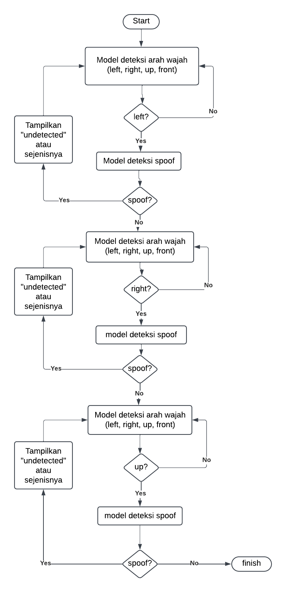

# liveness_ai

## Deskripsi Proyek
Proyek ini bertujuan untuk mendeteksi **liveness** dalam sistem autentikasi biometrik menggunakan data visual dan analisis dengan beberapa step seperti: looking up, looking left and right, and front facing.

## Tools dan Teknologi
- **Bahasa**: Python
- **Platform**: Jupyter Notebook, Google Colaboratory
- **Library**:
  - TensorFlow (>= 2.17; downgrade ke < 2.15 saat menulis metadata untuk MediaPipe)
  - Keras
  - OpenCV
  - MediaPipe

## Metodologi
- Menggunakan **transfer learning** dengan model MobileNet untuk mendukung proses pelatihan dan pengenalan fitur.
- **Downgrade TensorFlow** diperlukan saat menggunakan MediaPipe untuk memastikan kompatibilitas.

## Dataset
- **Datasets-new**: [Link Google Drive](https://drive.google.com/drive/folders/1HAqwfKzKlHB5QsR4p2bBuwI9ROx_vy0b)
- **Other-model**: [Link Google Drive](https://drive.google.com/drive/folders/1HAqwfKzKlHB5QsR4p2bBuwI9ROx_vy0b)
